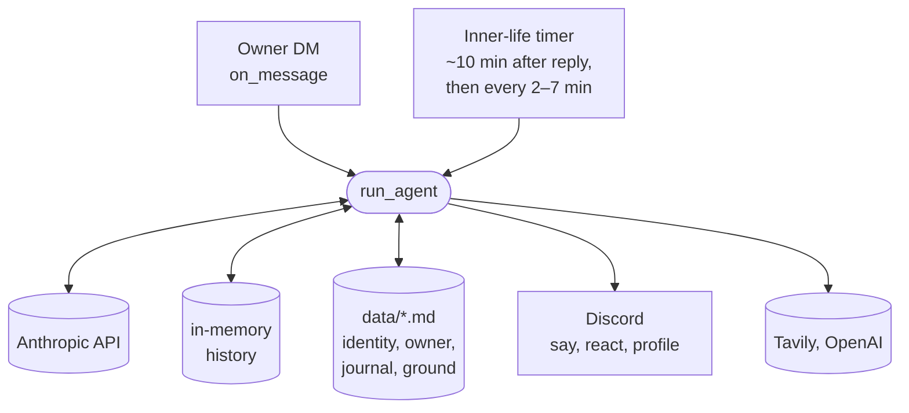
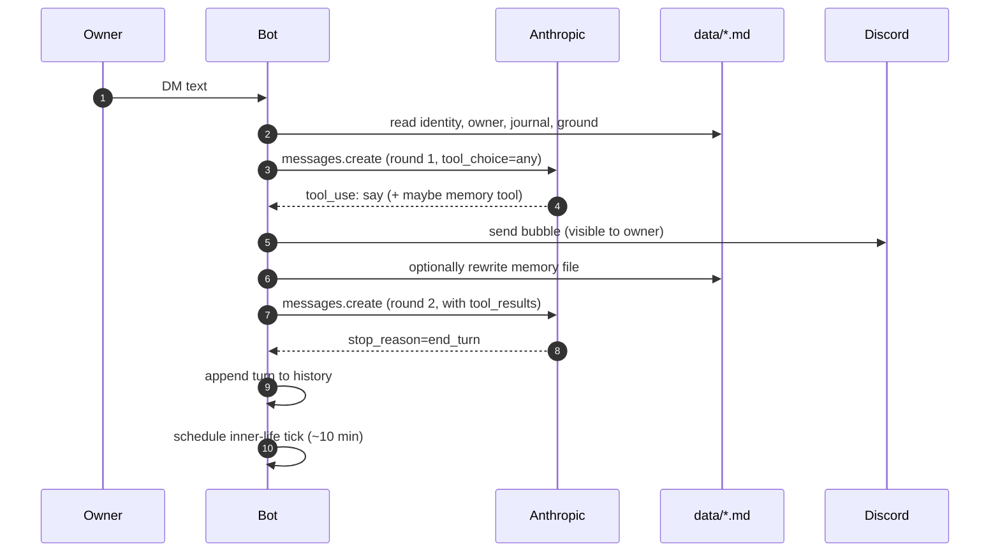

# Discord Companion Bot

A small Discord bot that starts with almost no self-model, talks with one owner in DMs, and gradually develops a name, personality, avatar, owner model, and journal through conversation.

The implementation is intentionally simple: one Python bot, local markdown files for memory, and a lightweight eval harness.

## What It Does

- Responds only to DMs from `OWNER_DISCORD_ID`.
- Uses Claude via the Anthropic API for conversation and tool use.
- Reads and writes local markdown memory in `data/`.
- Has an inner-life timer that can journal, research, change appearance, or occasionally reach out.
- Can generate a Discord avatar through OpenAI image generation.
- Can attempt a real Discord username change when a name emerges.
- Logs agent runs and tool calls to `logs/agent.jsonl`.

## Layout

```text
src/bot.py          # Discord client, agent loop, tools, scheduling
src/memory.py       # markdown state paths, reset, identity helpers
src/agent_logging.py  # JSONL/stdout agent trace logging
railway.json        # Railway start command and restart policy
seed/ground.md      # author-provided grounding prompt, restored on reset
seed/identity.md    # starting identity seed, restored on reset
data/identity.md    # bot identity, name, current appearance
data/owner.md       # evolving model of the owner / relationship
data/journal.md     # inner-life notes and reflections
logs/agent.jsonl    # full agent run logs
evals/              # headless conversation scenarios and judge harness
```

`data/`, `logs/`, `.env`, and `evals/results/` are ignored by git.

## Architecture

Three views of the same bot. The first shows what wakes it up; the second shows what happens inside one run; the third shows which tools are available where.

### 1. Triggers and state

Two triggers converge on the same agent loop. Conversation history lives in memory for the process; long-term self-model lives in markdown files.



### 2. One agent run

A single DM walked end-to-end. The loop keeps spinning as long as the model wants more tool calls, capped at 12 rounds. The first DM round forces tool use; any loose text from later rounds is captured and sent as fallback if no `say` bubble was sent.



### 3. Tools by context

The same `run_agent` runs in both contexts. The wake prompt differs; the tool loop does not.

| Tool | dm | inner_life | Side effect |
|---|:-:|:-:|---|
| `say` | ✓ | ✓ | Discord message bubble |
| `react` | ✓ | ✓ | Discord reaction |
| `update_identity` | ✓ | ✓ | rewrite `data/identity.md` |
| `update_owner_model` | ✓ | ✓ | rewrite `data/owner.md` |
| `update_journal` | ✓ | ✓ | rewrite `data/journal.md` |
| `web_search` | ✓ | ✓ | Tavily query |
| `update_name` | ✓ | ✓ | Discord username + identity |
| `update_avatar` | ✓ | ✓ | OpenAI image + Discord avatar |

## Setup

1. Install dependencies:

   ```bash
   uv sync
   ```

2. Create `.env`:

   ```bash
   cp .env.example .env
   ```

3. Fill in required variables:

   ```bash
   DISCORD_BOT_TOKEN=...
   OWNER_DISCORD_ID=...
   ANTHROPIC_API_KEY=...
   ```

4. In the Discord developer portal:

   - Create an application and bot.
   - Enable the `MESSAGE CONTENT INTENT`.
   - Invite the bot to a test server.
   - DM the bot from the owner account.

## Run

```bash
uv run python src/bot.py
```

You should see:

```text
Logged in as <bot-name> (id=...)
```

Then DM the bot from the Discord account whose numeric ID is `OWNER_DISCORD_ID`.

## Railway Deploy

This bot is a long-running worker, not an HTTP service. It does not need a public Railway domain.

1. Push the repo to GitHub.

2. Create a new Railway project from that GitHub repo.

3. Railway will read `railway.json` and run:

   ```bash
   python src/bot.py
   ```

4. Add service variables in Railway:

   ```bash
   DISCORD_BOT_TOKEN=...
   OWNER_DISCORD_ID=...
   ANTHROPIC_API_KEY=...
   OPENAI_API_KEY=...
   TAVILY_API_KEY=...
   BOT_RESET_STATE=1
   BOT_DEFAULT_USERNAME=...
   RAILPACK_PYTHON_VERSION=3.11
   ```

   `OPENAI_API_KEY`, `TAVILY_API_KEY`, `BOT_RESET_STATE`, and `BOT_DEFAULT_USERNAME` are optional. For the first evaluator run, `BOT_RESET_STATE=1` is useful; after that first clean deploy, change it back to `0` so redeploys preserve memory.

5. Attach a Railway volume to the bot service.

   The code automatically detects Railway's `RAILWAY_VOLUME_MOUNT_PATH` and stores:

   ```text
   <volume>/data/
   <volume>/logs/
   ```

   A mount path like `/bot-state` is fine.

6. Deploy, then check logs for:

   ```text
   Logged in as <bot-name> (id=...)
   ```

7. Keep the service scaled to one replica. This bot has one Discord connection
   and local markdown state, so multiple replicas would duplicate listeners and
   compete over the same files.

8. DM the bot from the owner account and verify that `data/identity.md`, `data/owner.md`, and `data/journal.md` are written under the attached volume.

## Environment

Required:

- `DISCORD_BOT_TOKEN`: bot token from the Discord developer portal.
- `OWNER_DISCORD_ID`: numeric Discord user ID allowed to talk to the bot.
- `ANTHROPIC_API_KEY`: used by the Anthropic Python SDK.

Optional:

- `OPENAI_API_KEY`: enables `update_avatar`.
- `TAVILY_API_KEY`: enables web search.
- `BOT_RESET_STATE=1`: starts from a clean demo state.
- `BOT_DEFAULT_USERNAME`: username to restore on reset, if Discord accepts the change.
- `BOT_DATA_DIR`: override local memory directory.
- `BOT_LOGS_DIR`: override log directory.

On Railway, `BOT_DATA_DIR` and `BOT_LOGS_DIR` are usually unnecessary if a volume is attached; Railway provides `RAILWAY_VOLUME_MOUNT_PATH`, and the bot stores `data/` and `logs/` underneath it automatically.

## State And Reset

Normal restarts preserve the bot's local memory. That is the default path for a long-running server.

For a clean evaluator/demo run:

```bash
BOT_RESET_STATE=1 uv run python src/bot.py
```

Reset behavior:

- Restores `data/identity.md` and `data/ground.md` from `seed/`.
- Clears `data/owner.md` and `data/journal.md`.
- Removes legacy `data/avatars.md`, if present.
- Removes `logs/avatar_history/`.
- On Discord ready, tries to reset the visible avatar to default.
- If `BOT_DEFAULT_USERNAME` is set, tries to reset the real Discord username.

Discord can reject or rate-limit profile changes. The bot logs those failures and keeps running.

## Memory Model

The system prompt is rebuilt for each agent run from:

- `data/ground.md`: author guidance.
- `data/identity.md`: the bot's current self-model, name, and appearance.
- `data/owner.md`: the bot's picture of the owner and relationship.
- `data/journal.md`: inner-life notes and longer-running threads.

Conversation history is kept in memory for the current process. Long-term state is whatever the bot chooses to write into the markdown files.

To make memory less opportunistic without adding a separate memory pipeline, each owner message pushes the next inner-life tick to about ten minutes after the bot's reply. If the conversation stays quiet, that tick sees the recent history and can journal, update memory, search, change appearance, or proactively reach out. After that, inner-life ticks continue on the normal 2-7 minute interval.

## Tools

The model can call:

- `say`: send a Discord message bubble.
- `react`: react to the owner's last DM.
- `update_identity`: rewrite `data/identity.md`.
- `update_owner_model`: rewrite `data/owner.md`.
- `update_journal`: rewrite `data/journal.md`.
- `web_search`: search through Tavily.
- `update_avatar`: generate an image and set the bot avatar.
- `update_name`: attempt a real Discord username change and record it in identity only after success.

The first DM round still forces tool use so the bot responds through the tool protocol, but all tools are visible immediately.

The owner can also DM `!export_state` to receive `identity.md`, `owner.md`, and `journal.md` as Discord file attachments. This command is handled before the LLM path and is still gated by `OWNER_DISCORD_ID`.

## Evals

Run all scenarios without the judge:

```bash
uv run python -m evals.run --no-judge
```

Run one scenario:

```bash
uv run python -m evals.run mundane_hi --no-judge
```

Run with judging:

```bash
uv run python -m evals.run
```

The judge path uses `claude -p`, so it requires the Claude CLI to be installed and logged in. Scenario execution itself uses the Anthropic API.

Reports are written to:

```text
evals/results/<timestamp>/report.md
```

The eval harness mocks Discord sends/reactions, avatar updates, and web search. Memory file writes go through to a temporary per-scenario `data/` directory so the final identity, owner model, and journal can be inspected. At the end of each scenario, the harness runs one inner-life tick directly rather than waiting ten real minutes.

## Failure Handling

- Anthropic timeout, connection, and rate-limit errors are retried with exponential backoff.
- If an agent run fails before anything user-facing is sent, the bot sends a short fallback message.
- Discord send/react/avatar/name failures return tool results instead of crashing the bot.
- Profile changes update `identity.md` only after Discord accepts the visible change.

## Notes For Review

This is intentionally not a general multi-user bot. It is DM-only and owner-gated so the interaction can focus on the relationship-building behavior requested by the take-home.
